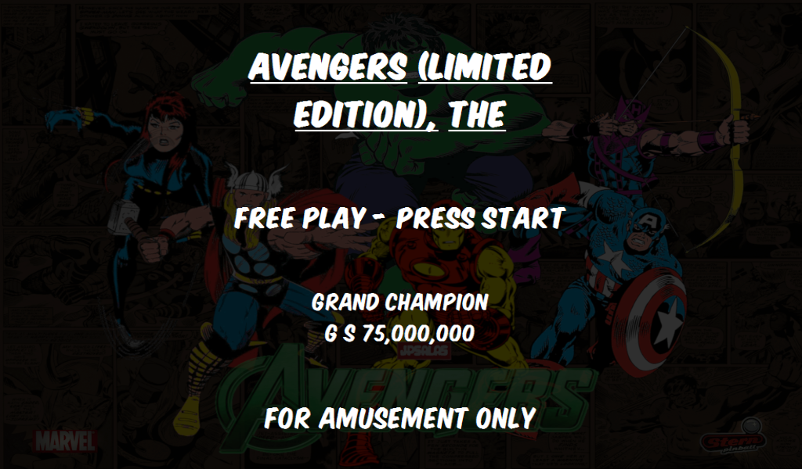
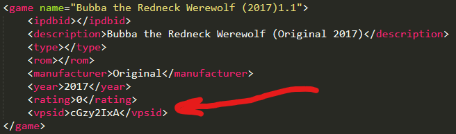
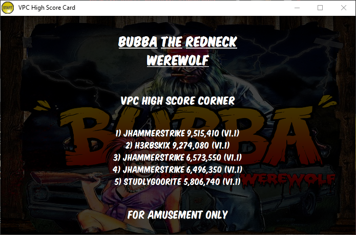
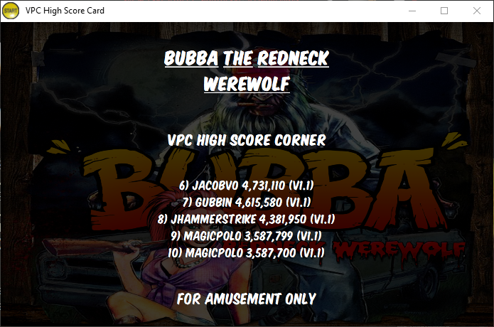
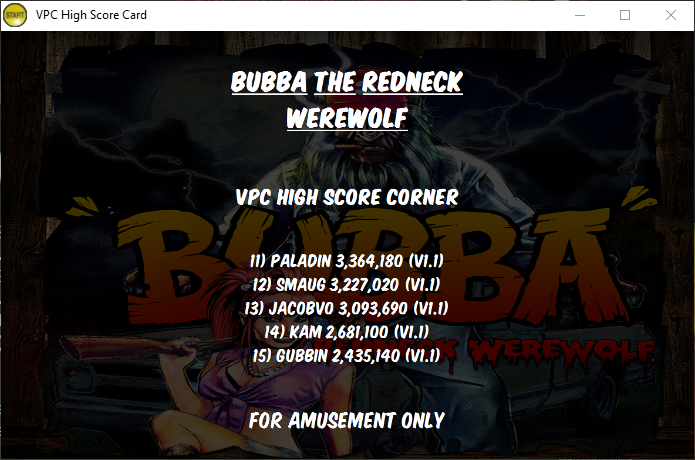
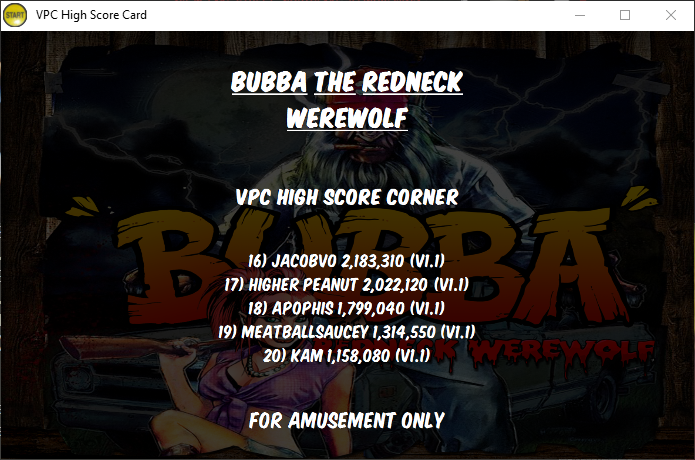
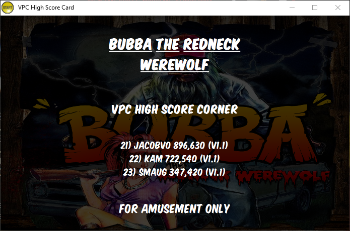
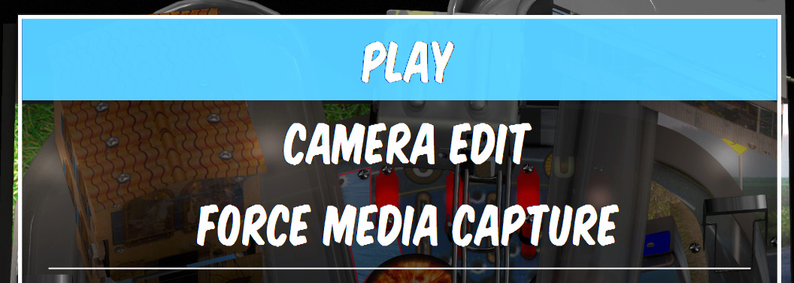

# PinballY-Scripts

## What scripts?

- `launchAnimations`: adds custom media for loading animations
- `launchLoadingVideo`: displays a single loading animation file for all tables
- `randomLoadingAnimations`: displays a random file from `Videos` for loading animation
- `showApronCard`: adds a new apron card screen that displays high scores for tables
- `toggleDmdWindow`: toggles the DMD window off when a table is started
- `vpcHighScores`: adds a new VPC "High Score Corner" screen

## How do I set it up?

### Loading Animations

Unfortuantely PBY doesnt support rotation for video (though I openened a bug because I think it should have been enabled) so you will need to rotate videos to portrait mode. Loading animations on VPU are not setup so I have included a batch file that can re-orient them properly for now. Hopefully PBY will be updated to allow custom media rotation so that the videos won't need to be processed. The updside: running the videos through `ffmpeg` to re-orient them reduces the file size pretty significantly in most cases, but I don't really notice any serious lack of quality or anything. YMMV...

To use the batch file you will need to alter the path to `ffmpeg`. The batch file is intended to be ran from a subfolder so it doesn't overwrite the video files, but you can also change that is you wish. The custom media is setup per-system (FP, VP9, VPX, etc.) with a folder name of `Loading Animations`. To use the batch file you will first want to add/navigate to the proepr folder (e.g., `Media\Visual Pinball X\Loading Animations`) and add a subfolder (any name will do; I chose `to-fix`) and add the animation videos to rotate as well as the batch file.


Then, simply double click the batch file and all the videos will be re-oriented and saved into the parent directory where PBY can access them. Oncethe process is complete you can remove the videos from `to-fix` (or whatever you named the folder) but keep the batch file there for later, just in case...


### Getting it working

1. Add the script to your `main.js`
    ```
    import 'launchAnimations.js';
    ```
2. Edit the `launchAnimations.js` file to set the values as you like. At a minimum you will want to change the default video name if you want a default loading animation to play.
    ```
    // START - Edit these values
    // ------------------------------------------

    // The name of the default launch animation
    // This should be in you `Videos` folder
    const defaultLaunchFileName = 'playfield.mp4';

    // Use a random video
    // If this is `true` then the default file above is ignored
    const useRandomVideo = true

    // Whether or not to disable the wheel image when the animation plays
    const disableWheel = true;

    // Whether or not to disable the messaging when the animation plays
    const disableMessaging = true;

    // ------------------------------------------
    // END - Edit these values
    ```
3. Run PinballY

## Additional Scripts

### Show Apron Card

Originally a copy/paste of the suggestion in the help docs, this morphed a bit to show parsed score information and cycle thru the scores when there are multiple score "groups". It was also modified to allow for some simple customizations for those that are not JS savvy or are not comfortable editing scripts.

#### Examples

**Multiple Groups**




**No High Score Info**


### Toggle DMD Window

I was haviing some weird behavior with my FUllDMD and any PuP packs where the PBY DMD would display a black screen over the top of the PuP pack making it so the PuP animation/image would not show. This was a quick script I created to toggle the PBY DMD off when a game starts and toggle it back on when the game ends.

### VPC "High Score Corner"

Apophis issued me a friendly challenge in the VPC #pinbally channel - could I integrate scores from the VPC #high-score-corner channel? He gave me some direction by linking a [github repo](https://github.com/ericfaris/vpc-get-high-scores-image#readme) maintained by Eric Faris that integrated the scores with Popper. The repo gave me everything I needed to figure out how to get the high score info.

I had recently worked on implementing an additional apron card so things were fresh. I used that knowledge to determine that I could make an API call on-the-fly to get the scores data and dynamically create the high score card. This is a bit different than what Eric did for Popper but I think it is a good way to go about it. I store the scores in memory so to not hammer the API endpoint, so it is the equivalent of getting all the scores up front - and I don't get ALL the scores, just the ones that are viewed on the PBY wheel, so it could potentially even save some API traffic.

Anyway, the hard part of this all is the linking of the VPS data: PBY doesn't have an interface for adding additonal metadata to a table, but the data is in a simple XML "database" file, so it is easily editable. However, I am a software engineer by trade, so XML is like simple math, but I know for some people it is like algebra or calculus. I will try to make it easy to understand how to edit the XML file, but I am also working on a "companion app" for PBY that will read the XML file, give you a nioce web UI to edit information, save it, and finally export the data back out to the XML database. However, there is still some work to be done there, and there is a trade-off in complexity (installing a node web app vs. editing an XML file). And I learned the hard way working on the app that the db XML is not encoded in utf-8! :unamused:

#### Editing the XML

1. Open your `Visual Pinball X.xml` database file (located in the Databases\Visual Pinball X folder)
2. Add a new `<vpsid>` element with the VPS ID value ([from the website](https://virtual-pinball-spreadsheet.web.app/))
3. Save the file



In the above example the Bubba table's VPS ID is `cGzy2IxA`, so I added the following element:
```
<vpsid>cGzy2IxA</vpsid>
```

It is really pretty simple once you get the hang of it. If you use a nice text editor like Sublime it can even help you out by auto-closing the element tags.

Once you have added the VPS ID's for your tables, you will need to restart PBY. If you do this in batches, each time you want to see any XML database updates, it will require a resatrt of PBY.

#### Where do I get the VPS ID?

Check the README on Eric's [github repo](https://github.com/ericfaris/vpc-get-high-scores-image#readme) for some pretty pictures and helpful annotations to show you how to find the VPS ID on the [website](https://virtual-pinball-spreadsheet.web.app/)]. He also explains how you can export the data to a CSV, but I am not sure how helpful that is. I tried it this way and you will have to use the "Pinup Popper" export (the "Pinball X" export does _not_ include the VPS ID), but there is so much information it was not really any easier. I actually preferred the web UI to lookup the table and find the match VPS ID for my table.

#### Card Examples











## Additonal Menu Items



- `tableEdit.js`: will add a menu item to allow you to enter camera edit mode in VPX
- `forceCapture.js`: bypasses the normal media capture flow to use the same previous settings for the current capture (e.g., if you have selected to capture the table image and dmd image, then those will be the settings used for the force capture)

### Table Edit

You will want to alter the script to point to the location of your `table-edit.bat` file (included in the repo). You will also want to edit the batch file to point to your VPX install location.

## Media Processing

I have included a batch files to process media:

- `to-mp4.bat`: converts `.mov` files to `.mp4`

## Pinup Issues

Some tables would not close pinup player so I took MJR's advice and created the batch file to force it closed. To use it:

- Add to VPX "Run after (1)":
  ```
  cmd /c [PINBALLY]\Scripts\close-pinup.bat
  ```