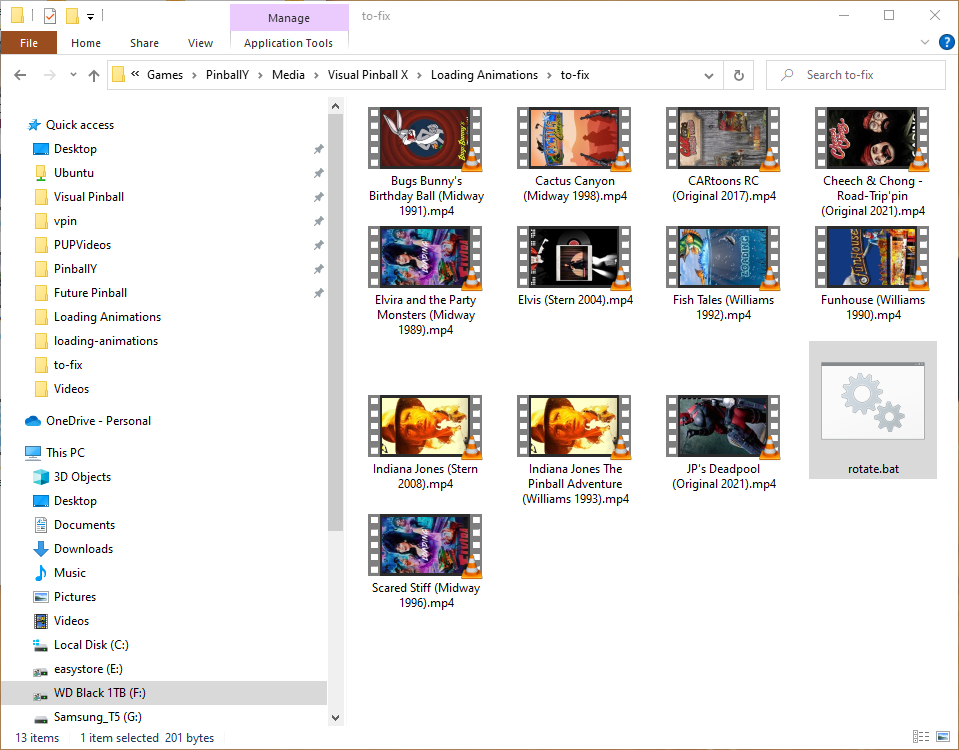
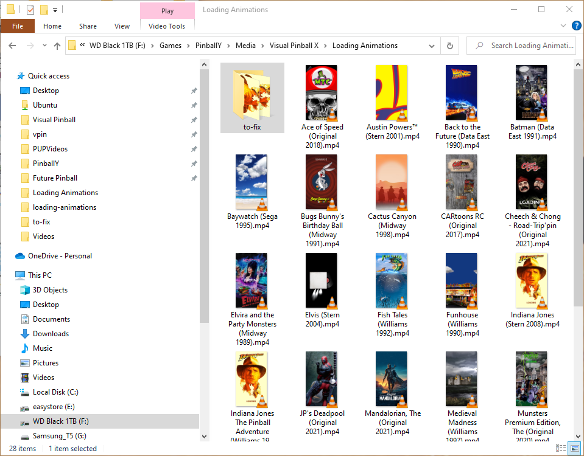

# PinballY-Scripts

## What scripts?

- `launchAnimations`: adds custom media for loading animations

## How do I set it up?

### Loading Animations

Unfortuantely PBY doesnt support rotation for video (though I openened a bug because I think it should have been enabled) so you will need to rotate videos to portrait mode. Loading animations on VPU are not setup so I have included a batch file that can re-orient them properly for now. Hopefully PBY will be updated to allow custom media rotation so that the videos won't need to be processed. The updside: running the videos through `ffmpeg` to re-orient them reduces the file size pretty significantly in most cases, but I don't really notice any serious lack of quality or anything. YMMV...

To use the batch file you will need to alter the path to `ffmpeg`. The batch file is intended to be ran from a subfolder so it doesn't overwrite the video files, but you can also change that is you wish. The custom media is setup per-system (FP, VP9, VPX, etc.) with a folder name of `Loading Animations`. To use the batch file you will first want to add/navigate to the proepr folder (e.g., `Media\Visual Pinball X\Loading Animations`) and add a subfolder (any name will do; I chose `to-fix`) and add the animation videos to rotate as well as the batch file.



Then, simply double click the batch file and all the videos will be re-oriented and saved into the parent directory where PBY can access them. Oncethe process is complete you can remove the videos from `to-fix` (or whatever you named the folder) but keep the batch file there for later, just in case...




### Getting it working

1. Add the script to your `main.js`
    ```
    import 'launchAnimations.js';
    ```
2. Edit the `launchAnimations.js` file to set the values as you like. At a minimum you will want to change the default video name if you want a default loading animation to play.
    ```
    // START - Edit these values
    // ------------------------------------------

    // The name of the default launch animation
    // This should be in you `Videos` folder
    const defaultLaunchFileName = 'homeplayfieldsamplevideos';

    // Whethar or not to disable the wheel image when thew animation plays
    const disableWheel = true;

    // Whethar or not to disable the messaging when thew animation plays
    const disableMessaging = true;

    // ------------------------------------------
    // END - Edit these values
    ```
3. Run PinballY
